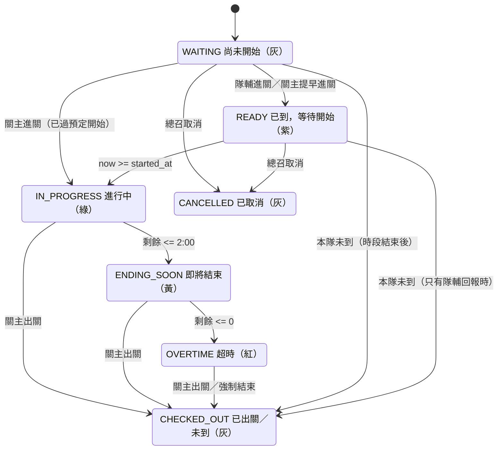
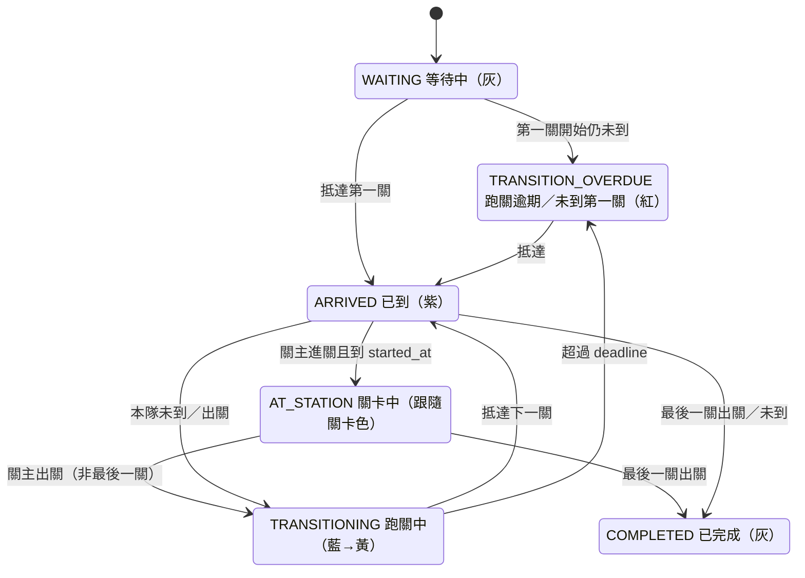

# 宿營跑關即時管理系統

> 給之後辦宿營的學弟妹：這是我們 2026 年宿營實際用的跑關系統。手機打開網頁就能用，不用裝 App。
> 照下面「[給下一屆：從零到上線](#quickstart)」一步一步做，就能換成你們自己的排程。

大學宿營「黃金傳奇」（上午）與「大地遊戲」（下午）的即時跑關管理系統：
**抵達確認＋進關／出關雙方打卡＋關卡即時計時＋跑關 7 分鐘計時＋全場即時 Dashboard＋超時通知＋現場突發狀況處理**（誤按撤銷、整場延後、關卡取消、延長時間、漏按出關、大地缺隊）。

手機瀏覽器直接使用，不用安裝 App；多台手機同時操作，所有人看到的狀態即時同步，重新整理後資料不會消失。

---

<a id="why"></a>

## 它解決了什麼問題

以前跑關靠紙本排程表、對講機和群組訊息，常見的狀況是：

| 以前的問題 | 這套系統怎麼處理 |
|---|---|
| 關主各自看手錶計時，有人提早結束、有人拖延，整條路線越跑越亂 | 計時以伺服器時間為準，所有手機同一個時鐘；提早到的隊伍從預定時間才開始算 |
| 總召不知道哪一關超時、哪一隊還在路上 | 全場 Dashboard 即時顯示每一關、每一隊的狀態，超時／跑關逾期自動通知 |
| 小隊不知道下一關在哪、要幾點到 | 隊輔手機自動顯示「下一關、須於幾點前抵達、跑關倒數」 |
| 關主忘了按結束，下一關卡住 | 系統偵測「隊伍已到下一關、上一關還沒出關」，跳紅色提醒；下一關照常進行 |
| 按錯了沒辦法改、事後對不起來 | 1 分鐘內自己撤銷，之後由總召修正；所有紀錄都保留、有稽核紀錄 |
| 下雨要停辦水關、整場要延後 | 總召在管理頁一鍵延後或取消，所有人的時間與路線自動更新 |
| 大地遊戲兩隊 PK，只來一隊 | 必須兩隊都到才能開始；等人造成的延誤自動壓縮時間，不拖累下一場 |

技術上用 **Next.js（網站）＋ Supabase（資料庫與即時同步）＋ Vercel（部署）**，三個都有免費方案，一次宿營的量完全夠用。

## Demo：


https://github.com/user-attachments/assets/898b9ca0-da24-451c-91b4-5768e7e03866


---

<a id="quickstart"></a>

## 給下一屆：從零到上線（step by step）

> 不需要會寫程式也能照著做完；只有「換成新年度排程」那一步可能要改幾行設定（下一節有清單）。
> 每一步的詳細說明在後面的「[安裝與部署 step-by-step](#steps)」。

### 你需要準備

- 一台電腦（Windows／Mac 都可以）
- 免費帳號：[GitHub](https://github.com)、[Supabase](https://supabase.com)、[Vercel](https://vercel.com)
- 你們今年的兩份排程 Excel（格式見第 3 步）

### 步驟

1. **複製這個專案**
   - 在 GitHub 按 **Fork**（或 Use this template），建立你們自己的 repo（建議設成 Private）。
   - 用 GitHub Desktop 或 `git clone` 下載到電腦。

2. **安裝環境**
   - 安裝 [Node.js](https://nodejs.org) LTS 版（20.19 以上或 22.12 以上）。
   - 在專案資料夾打開 terminal，執行 `npm install`。

3. **準備排程 Excel**，放進 `data/` 資料夾。每份 Excel 的「正式工作表」版面要長這樣：
   - 第 1 列（B 欄起）：關卡名稱
   - 第 2～9 列：第 1～8 時段；A 欄是時間，格式 `09:10 - 09:25`
   - 黃金（一關一隊）：格子填小隊編號，例如 `2`
   - 大地（兩隊 PK）：格子填 `6/8`（第 6 隊 vs 第 8 隊）、`7/幹`（第 7 隊 vs 幹部隊）；空格 = 該關這個時段休息
   - 第 12 列（B 欄起）：關卡代號 `A`、`B`、`C`…
   - 可以直接參考 `data/` 裡 2026 年的兩份 Excel。

4. **改成你們今年的設定**（見下一節「[換成新年度要改哪裡](#new-year)」），然後執行：

   ```bash
   npm run import:check
   ```

   它會檢查 Excel 並列出每一個錯誤的儲存格（例如「大地新跑關!C5：…」）。**改到顯示「Validation 通過」為止。** 這一步不需要任何帳號。

5. **建立 Supabase 資料庫**
   - Supabase 後台 → New project，區域選 **Northeast Asia (Tokyo)**，記下資料庫密碼。
   - 在專案資料夾依序執行（`<project-ref>` 是後台網址 `supabase.com/dashboard/project/` 後面那串）：

   ```bash
   npx supabase login
   npx supabase link --project-ref <project-ref>
   npx supabase db push
   ```

6. **設定 `.env.local`**：複製 `.env.example` 成 `.env.local`，填入：
   - `NEXT_PUBLIC_SUPABASE_URL`：Project Settings → Data API 的 Project URL，**只填到 `.supabase.co`，後面不要加 `/rest/v1`**
   - `NEXT_PUBLIC_SUPABASE_ANON_KEY`：Project Settings → API Keys 的 Publishable key
   - `SUPABASE_SERVICE_ROLE_KEY`：同一頁的 Secret key（**絕對不要外流或 commit**）
   - `SESSION_SECRET`：執行 `node -e "console.log(require('crypto').randomBytes(48).toString('base64url'))"` 產生
   - `INITIAL_ADMIN_PIN`：總召的 6 位數 PIN
   - `EVENT_DATE`：活動日期，例如 `2027-10-09`
   - `APP_ENV`：彩排期間填 `demo`

7. **匯入排程與產生 PIN**

   ```bash
   npm run import
   ```

   - 會建立所有關卡、隊伍、排程，以及每個關主／隊輔／總召／唯讀的 PIN。
   - PIN 明碼只會出現在 terminal 和專案根目錄的 `pins-日期時間.csv`，**請保存好**（資料庫只存加密後的 hash，查不回來）。

8. **（可選）在自己電腦試跑**：`npm run dev`，打開 <http://localhost:3000>，用總召 PIN 登入。

9. **部署到 Vercel，拿到大家用的網址**
   - 把專案推到 GitHub → Vercel 按 **Add New → Project**，選這個 repo → Import。
   - 在 Environment Variables 貼上 `.env.local` 的 7 個變數（可以整段貼上）。
   - Deploy，完成後會得到像 `https://你的專案.vercel.app` 的網址。

10. **發 PIN 給大家**：總召登入 → `/admin` →「PIN 總表」，每個身分都有登入 QR code，可以列印成小卡，連同 PIN 發給關主和隊輔。

11. **彩排**：`/admin` →「Demo 與 Reset」→ 開 Demo 模式、倍速 ×10、跳到 09:08，找幾支手機實際跑一輪（建議流程見[彩排建議流程](#step-17)）。

12. **正式活動前（固定順序）**
    1. `/admin` → Reset Demo Data（清掉彩排紀錄）→ 關閉 Demo
    2. Vercel 把 `APP_ENV` 改成 `production` → Deployments → 重新部署
    3. 確認：頂端沒有紫色「DEMO」橫幅、沒有殘留的延後／取消、活動日期正確

13. **活動前一週**：登入 Supabase 後台確認 project 是 Active（免費專案一段時間沒用會被自動暫停）。

### 我們踩過的雷

| 狀況 | 原因與解法 |
|---|---|
| `npm run import` 出現「Invalid path specified in request URL」 | `NEXT_PUBLIC_SUPABASE_URL` 多貼了 `/rest/v1/`，只留到 `.supabase.co` |
| push 到 GitHub 後網站沒更新 | Vercel 的「Redeploy」只會重跑**舊的那一版**；要到 Deployments 用 **Create Deployment** 選 `main` 部署最新 commit |
| Vercel 環境變數打開是空的 | 存成 Secret 類型的變數存完就看不到值，不代表沒設定；要改就直接重填 |
| 開不了 Demo 模式／不能 Reset | `APP_ENV` 不是 `demo`（或 `development`）；改完要重新部署才生效 |
| 同一台電腦登入第二個身分，第一個被登出 | 登入是依網址存在瀏覽器；同一台電腦要測多個身分，用不同瀏覽器／無痕視窗，或用手機 |
| 手機沒有提示音 | 要先按一次頂端「開啟聲音」；iPhone 沒有震動；手機鎖屏或切到其他 App 不會提醒 |
| 營地訊號差 | 活動前到每個關卡位置實際開一次關主頁，看頂端是不是綠色「即時」；沒訊號的關卡準備熱點 |

---

<a id="new-year"></a>

## 換成新年度要改哪裡

只要新排程跟 2026 年的**結構一樣**（每個遊戲 8 個時段、黃金一關一隊、大地兩隊 PK、13 小隊＋幹部隊），通常只要改下面這幾個地方：

| 要改的東西 | 檔案 | 說明 |
|---|---|---|
| 各時段的正式時間 | `src/lib/constants.ts` 的 `OFFICIAL_SLOTS` | import 會檢查 Excel 的 A 欄時間跟這裡完全一致 |
| 關卡時間／跑關時間 | `src/lib/constants.ts` 的 `GAME_DEFAULTS` | 黃金 900 秒（15 分）、大地 1200 秒（20 分）、跑關 420 秒（7 分） |
| Excel 檔名 | `src/lib/import/config.ts` 的 `DEFAULT_EXCEL_PATHS` | 或執行時用 `--gold <路徑> --land <路徑>` 指定 |
| 正式工作表名稱 | `src/lib/import/config.ts` 的 `OFFICIAL_SHEET_NAMES` | 同一份 Excel 裡其他工作表會被忽略 |
| 關卡數量與代號 | `src/lib/import/config.ts` 的 `EXPECTED_STATION_CODES` | 2026 年黃金 A~M（13 關）、大地 A~J（10 關） |
| 小隊數、大地每時段 PK 組數 | `src/lib/import/config.ts` 的 `TEAM_COUNT`、`LAND_PAIRS_PER_SLOT` | 13 小隊＋幹部隊 = 14 隊 → 每時段 7 組 PK |
| Excel 關名跟顯示名稱不同 | `src/lib/import/config.ts` 的 `STATION_DISPLAY_NAME_OVERRIDES` | 例如 Excel 寫「幾隻小鳥幾隻腳(是大地變黃金)」、畫面只顯示「幾隻小鳥幾隻腳」 |
| Excel 某格有錯、人工確認過的修正 | `src/lib/import/overrides.ts` | 2026 年有一格原檔是空白，人工確認為 2/4；**新年度請清空，換成你們自己的** |
| 遊戲名稱 | `src/lib/constants.ts` 的 `GAME_NAMES`、`GAME_DEFAULTS` | 「黃金傳奇」「大地遊戲」 |

改完執行 `npm run import:check` 驗證。

**關於測試**：`tests/unit/import-*.test.ts` 和 `tests/unit/fixtures/game.ts` 裡寫死了 2026 年的排程（例如「第2小隊路線是 A→C→B…」）。換成新 Excel 後這些測試會失敗是正常的，改成新年度的內容或刪掉那幾個斷言即可；真正把關排程正確性的是 `npm run import:check`。

**結構不一樣**（例如時段不是 8 個、一關三隊）就需要改程式，請先讀 `docs/SPEC.md`（完整需求）和 `docs/ARCHITECTURE.md`（模組分工）。

---

## 目錄

- [它解決了什麼問題](#why)
- [給下一屆：從零到上線（step by step）](#quickstart)
- [換成新年度要改哪裡](#new-year)

1. [系統概觀](#overview)
2. [安裝與部署 step-by-step（18 步）](#steps)
   1. [安裝 Node.js（20.19 以上或 22.12 以上）](#step-1)
   2. [npm install](#step-2)
   3. [建立 Supabase project](#step-3)
   4. [執行 migration](#step-4)
   5. [設定 .env.local](#step-5)
   6. [Excel 放哪裡](#step-6)
   7. [匯入排程（先 import:check 再 import）](#step-7)
   8. [localhost 啟動](#step-8)
   9. [建立管理員（INITIAL_ADMIN_PIN）](#step-9)
   10. [測試隊輔頁](#step-10)
   11. [測試關主頁](#step-11)
   12. [部署到 Vercel](#step-12)
   13. [正式活動前的 reset／seed（固定順序）](#step-13)
   14. [開 Demo Mode](#step-14)
   15. [列印 PIN 總表](#step-15)
   16. [現場突發狀況 SOP](#step-16)
   17. [彩排建議流程](#step-17)
   18. [提醒：Supabase 免費專案會被暫停](#step-18)
3. [本機開發（Docker 本機 Supabase）](#local-dev)
4. [測試](#tests)
5. [安全驗證：anon key 不能寫入](#anon-check)
6. [門檻常數在哪裡](#thresholds)
7. [設計決策](#decisions)
8. [state transition 表](#state-table)
9. [工作人員一頁說明（可直接列印）](#staff-sheet)
10. [專案結構](#structure)
11. [疑難排解](#troubleshooting)

---

<a id="overview"></a>

## 1. 系統概觀

### 使用者與頁面

| 身分 | 登入後進入 | 能做什麼 |
|---|---|---|
| 關主（STATION，每個「遊戲＋關卡」一組 PIN，共 23 組） | `/station/<gold\|land>/<關卡代號>`，例如 `/station/gold/A` | 自己關卡的確認進關／出關、本隊未到、1 分鐘內撤銷；看全場 Dashboard |
| 隊輔（TEAM，第 1~13 小隊＋幹部隊共 14 組，黃金／大地共用） | `/team` | 自己隊伍的確認進關／出關、1 分鐘內撤銷；看全場 Dashboard |
| 總召（ADMIN，PIN 來自 `INITIAL_ADMIN_PIN`） | `/admin` | 全部：修正紀錄、延後排程、取消關卡、延長、單隊開始、PIN、Demo、Reset、匯出；打開任何關主頁／隊輔頁都有同樣的按鈕（頂端標示「以總召身分操作」） |
| 唯讀（VIEWER，一組共用） | `/dashboard` | 只能看 |

| 路由 | 說明 |
|---|---|
| `/login` | 選身分類型 → 關主選遊戲與關卡／隊輔選隊伍 → 6 位數字 PIN |
| `/dashboard` | 依時間自動導向：黃金最後時段結束前 → `/dashboard/gold`，其後 → `/dashboard/land` |
| `/dashboard/gold`、`/dashboard/land` | 總 Dashboard：目前時段、時段剩餘、上一／目前／下一時段切換、摘要列、「只看異常」、關卡列（黃金 13 關、大地 10 關 VS 卡片）、「小隊視角」、通知中心 |
| `/station/gold/A` … `/station/land/J` | 關主頁（第十七、十八節）；用別關的 PIN 打開只顯示唯讀內容與「前往我的關卡」提示 |
| `/team` | 隊輔頁（第十六節）：自動顯示目前遊戲，可用 `?game=gold\|land` 手動切換；總召或其他身分可用 `/team?team=2` 查看指定隊伍（非本隊為唯讀） |
| `/admin` | 管理頁，分頁：總覽設定／排程調整／取消與延長／打卡紀錄／異常／PIN 總表／Audit log／匯出／Demo 與 Reset |

### 技術架構

- **Next.js 16（App Router）＋ TypeScript strict ＋ Tailwind CSS v4**，UI 元件自己寫在 `src/components/ui/`（shadcn 風格：cva＋clsx＋tailwind-merge）。
- **Supabase（PostgreSQL 15+、Realtime）**：所有正式紀錄存在資料庫；前端只用 anon（publishable）key 讀取與訂閱 Realtime。
- **所有寫入**走 Next.js Route Handler：先驗 httpOnly 簽章 cookie session（jose HS256），再用 service role 呼叫 Postgres function（RPC）。不使用 Supabase Auth。
- **狀態不落地**：DB 只存事件（打卡紀錄、延後、取消、延長、通知），所有狀態由同一組純函式 `deriveGame()` 推導（`src/lib/derive/`）。
- **統一時鐘**：SQL `app_now()`；前端向 server 校時後每秒自己算，Demo 倍速也用同一個公式。
- **部署**：Vercel（`vercel.json` 設 `regions: ["hnd1"]` 東京）＋ Supabase（Northeast Asia (Tokyo)）。
- PWA：`src/app/manifest.ts`、icons、apple-touch-icon，可「加入主畫面」。沒有 service worker（不快取任何 API／Realtime 回應），不做 Web Push。

### 活動資料（來自 Excel）

| | 黃金傳奇 | 大地遊戲 |
|---|---|---|
| 正式工作表 | 「黃金新路線」 | 「大地新跑關」 |
| 關卡 | 13 關（A~M） | 10 關（A~J），每個時段 7 關 PK、3 關休息 |
| 隊伍 | 第 1~13 小隊（沒有幹部隊） | 第 1~13 小隊＋幹部隊（共 14 隊，每關 2 隊 PK） |
| 時段 | 8 個，09:10–11:59 | 8 個，13:05–16:34 |
| 關卡時間 | 15 分鐘（FULL_DURATION） | 20 分鐘（FIXED_END） |
| 跑關時間 | 7 分鐘 | 7 分鐘 |

---

<a id="steps"></a>

## 2. 安裝與部署 step-by-step

> 指令在 Windows 的 PowerShell、Git Bash，或 macOS／Linux 的 terminal 都可以執行（有差異的地方會分開寫）。專案路徑含中文也沒問題。

<a id="step-1"></a>

### 步驟 1　安裝 Node.js（20.19 以上或 22.12 以上）

1. 到 <https://nodejs.org/> 下載並安裝 **Node.js 20.19 以上或 22.12 以上，建議最新 LTS**。
   （Vite 8／Vitest 需要 `^20.19.0 || >=22.12.0`，`package.json` 的 `engines` 也是這個範圍；20.0～20.18、22.0～22.11 無法執行測試。）
2. 開新的 terminal 確認：

   ```bash
   node -v   # v20.19 以上，或 v22.12 以上
   npm -v
   ```

<a id="step-2"></a>

### 步驟 2　npm install

在專案根目錄執行：

```bash
npm install
```

> `xlsx`（SheetJS）是從 `cdn.sheetjs.com` 安裝的官方版本，第一次安裝需要能連上網路。

<a id="step-3"></a>

### 步驟 3　建立 Supabase project

1. 到 <https://supabase.com/dashboard> 登入 → **New project**。
2. **Region 選 `Northeast Asia (Tokyo)`**（與 Vercel 的 `hnd1` 同一區，延遲最低）。
3. 設定一組資料庫密碼（`supabase link` 時會用到，請記下來）。
4. 等專案建立完成（約 1~2 分鐘）。

> 本系統需要 PostgreSQL 15 以上（用到 `NULLS NOT DISTINCT`）；新建立的 Supabase 專案都符合。
> 不需要設定 Supabase Auth、Storage、Edge Functions。

<a id="step-4"></a>

### 步驟 4　執行 migration

migration 在 `supabase/migrations/`，共三個檔案，**必須依檔名順序執行**：

| 檔案 | 內容 |
|---|---|
| `20260925000100_schema.sql` | tables、constraints、partial unique index、`v_slot_times` 等 view、`app_now()`／`get_clock()` |
| `20260925000200_functions.sql` | 所有寫入用 RPC（`record_check`、`undo_check`、修正、延後、取消、延長、時鐘、reset、通知、登入鎖定、PIN） |
| `20260925000300_security_realtime.sql` | 所有 table enable RLS、權限（REVOKE／GRANT）、Realtime publication |

**方式 A：有 Supabase CLI（建議）**

```bash
npx supabase login                                   # 開瀏覽器授權
npx supabase link --project-ref <你的 project ref>    # 會問資料庫密碼
npx supabase db push                                 # 依檔名順序套用全部 migration
```

`project ref` 就是網址 `https://<project-ref>.supabase.co` 中間那一段（後台 **Project Settings → General → Project ID** 也看得到）。

**方式 B：沒有 CLI，用 SQL Editor**

1. Supabase 後台左側 **SQL Editor** → **New query**。
2. 用文字編輯器打開 `supabase/migrations/20260925000100_schema.sql`，全部複製、貼上、按 **Run**。
3. 再依序對 `20260925000200_functions.sql`、`20260925000300_security_realtime.sql` 做一樣的事。
4. 三個檔案都要成功（下方顯示 `Success. No rows returned`）；任何一個失敗就不要往下做，把錯誤訊息記下來。

> 每個檔案在同一個 project 只執行一次。第三個檔案的 `ALTER PUBLICATION … ADD TABLE` 重複執行會報「already member of publication」。
> 要從頭重來：開一個新的 Supabase project（或本機 `npx supabase db reset`）。

<a id="step-5"></a>

### 步驟 5　設定 .env.local

複製範本：

```bash
cp .env.example .env.local          # PowerShell：Copy-Item .env.example .env.local
```

然後填入下列值：

| 變數 | 填什麼 | 在哪裡找 |
|---|---|---|
| `NEXT_PUBLIC_SUPABASE_URL` | `https://<project-ref>.supabase.co` | 後台 **Project Settings → Data API → Project URL**（或專案首頁上方 **Connect**） |
| `NEXT_PUBLIC_SUPABASE_ANON_KEY` | **Publishable key**（`sb_publishable_…`），或 legacy 的 **anon** key（`eyJ…`） | 後台 **Project Settings → API Keys**：新版 key 在「Publishable and secret API keys」分頁；舊版在「Legacy API Keys」分頁的 `anon` `public` |
| `SUPABASE_SERVICE_ROLE_KEY` | **Secret key**（`sb_secret_…`），或 legacy 的 **service_role** key | 同一頁：「Secret keys」區塊按 **Reveal** 複製（沒有的話按 **Create new secret key**）；舊版在「Legacy API Keys」的 `service_role` `secret` |
| `SESSION_SECRET` | 至少 32 字元的隨機字串（cookie 簽章用） | 自己產生：`openssl rand -base64 48`，或 `node -e "console.log(require('crypto').randomBytes(48).toString('base64url'))"` |
| `INITIAL_ADMIN_PIN` | 總召 PIN，**6 位數字** | 自己決定；只在第一次 import、資料庫還沒有總召身分時使用 |
| `EVENT_DATE` | 活動日期 `YYYY-MM-DD`，例如 `2026-10-17` | 只在第一次 import 建立活動時使用；之後一律在 `/admin`「總覽設定」修改 |
| `APP_ENV` | `development`（本機）／`demo`（彩排）／`production`（正式） | 只有 `development`、`demo` 允許開啟 Demo 與 Reset；**未設定視同 production** |
| `SUPABASE_TEST_URL`、`SUPABASE_TEST_SERVICE_ROLE_KEY` | DB 測試專用，**必須是另一個 project**（或本機 Docker） | 見[測試](#tests)；平常留空 |

> **`SUPABASE_SERVICE_ROLE_KEY` 絕對不可以加 `NEXT_PUBLIC_` 前綴**，它只在 server（`src/lib/server/`，檔案開頭 `import "server-only"`）與 `scripts/` 使用，前端 bundle 永遠拿不到。
> `.env*` 已在 `.gitignore`（`.env.example` 除外），不要把 `.env.local` 上傳。

<a id="step-6"></a>

### 步驟 6　Excel 放哪裡

兩份 Excel 放在專案的 `data/` 目錄，**檔名含中文與空白，保持原檔名**：

```
data/黃金新路線 的副本 的副本.xlsx      ← 讀工作表「黃金新路線」
data/大地新跑關 的副本 的副本.xlsx      ← 讀工作表「大地新跑關」
```

- 預設路徑寫在 `src/lib/import/config.ts` 的 `DEFAULT_EXCEL_PATHS`。
- 換檔名或放別處時用 CLI 參數指定（路徑有空白要加引號）：

  ```bash
  npm run import:check -- --gold "D:/某處/黃金 2027.xlsx" --land "D:/某處/大地 2027.xlsx"
  ```

- 每份檔案另一張工作表（「每個小隊跑的路線」「各隊跑關情況」）是舊版排程，**完全不讀取**。
- 已知的資料修正集中在 `src/lib/import/overrides.ts`（目前只有一筆：大地第4時段 B 關 `大地新跑關!C5` = `2/4`）。
  如果之後直接在 Excel 把 C5 改成 2/4，import 只會印提示；如果變成其他值，import 會報錯要求人工確認。

<a id="step-7"></a>

### 步驟 7　匯入排程（先 import:check 再 import）

**7-1. 只檢查，不連資料庫**（沒有 Supabase 也能跑）：

```bash
npm run import:check
```

會印出套用了哪些 overrides、正規化後的完整排程表（每時段每關哪一隊／哪兩隊 PK、哪幾關休息），最後一行是
`Validation 通過：兩份正式工作表的排程都合法。`
有錯誤時會**一次列出全部錯誤**（工作表名稱＋儲存格座標＋原因，例如 `大地新跑關!C5`），結束碼 1，不會寫入任何東西。

**7-2. 匯入 Supabase**（用 `.env.local` 的 `SUPABASE_SERVICE_ROLE_KEY`，只在本機執行）：

```bash
npm run import
```

會做的事：

1. 重新讀 Excel、套用 overrides、validation；不通過就不連資料庫。
2. 找唯一一筆 `is_active = true` 的活動；沒有才用 `EVENT_DATE` 建立。
3. 以自然鍵 upsert：`teams(code)`、`games(event_id, code)`、`stations(game_id, code)`、`time_slots(game_id, slot_number)`、`assignments(slot_id, station_id)`。
4. 建立 PIN 身分：14 組隊輔、23 組關主、1 組唯讀（隨機 6 位數）、總召（`INITIAL_ADMIN_PIN`）。
   **PIN 清單印在 terminal，並存成專案根目錄的 `pins-YYYYMMDD-HHmmss.csv`**（UTF-8 BOM，Excel 可直接開；含明碼，已在 `.gitignore`，請妥善保管）。
   資料庫只存 bcrypt hash，之後無法再查看明碼，只能在 `/admin` 重設。
5. 每個遊戲寫一筆 `IMPORT` audit log。

**重跑的行為（可以安全重跑）：**

- 不會覆寫：活動日期、Demo 時鐘設定、撤銷提醒的群組名稱、各遊戲的 `end_policy`／`min_play_seconds`、整場延後紀錄（這些只由 `/admin` 修改）。
- 會更新：時段的原定時間、關卡名稱；assignments 只補缺的，不重建、不產生重複。
- 已存在的 PIN 身分**不覆蓋**；沒有新身分時不產生 CSV。
- **該遊戲已經有打卡紀錄時，預設拒絕匯入**（什麼都不寫）。確定要清空再匯入時：

  ```bash
  npm run import -- --reset
  ```

  `--reset` 會用 `reset_game_records()` 清空該遊戲的執行期資料（打卡、通知、延後、取消、延長），**並關閉 Demo 時鐘**，然後匯入（寫 audit log）。排程與 PIN 不受影響。

其他參數：`--gold <路徑>`、`--land <路徑>`、`--help`。結束碼：0 成功、1 validation 或匯入失敗、2 參數錯誤。

<a id="step-8"></a>

### 步驟 8　localhost 啟動

```bash
npm run dev
```

打開 <http://localhost:3000>，會自動導向 `/login`。

其他指令：

```bash
npm run typecheck    # tsc --noEmit
npm run lint         # eslint
npm test             # vitest（單元＋DB 測試；DB 測試沒設定會 skip）
npm run build        # 正式 build
npm start            # 執行 build 後的版本
```

> 在一台電腦上模擬多台手機：登入 session 是**依網址的主機名稱分開存**的，同一個瀏覽器用不同主機名稱開就是不同的「手機」，
> 例如 <http://localhost:3000> 登入關主、<http://127.0.0.1:3000> 登入隊輔；也可以用一般視窗＋無痕視窗（或不同瀏覽器）。
> 同一個主機名稱的多個分頁共用同一個登入，後登入的會蓋掉前一個。
> 用真的手機測試建議部署到 Vercel（步驟 12，彩排用 `APP_ENV=demo`）：手機連不到電腦上的 `127.0.0.1` 本機 Supabase，而且亮屏（Wake Lock）與複製訊息需要 HTTPS。
> 登入 cookie 的 `Secure` 旗標跟著這次連線的協定走（Vercel 的 https → Secure；區網 `http://192.168.x.x:3000` → 不加 Secure），
> 所以 `npm run build && npm start` 後用區網 IP、純 http 測試也登入得了（前提是手機連得到 `NEXT_PUBLIC_SUPABASE_URL`）。

<a id="step-9"></a>

### 步驟 9　建立管理員（INITIAL_ADMIN_PIN）

總召身分在第一次 `npm run import` 時自動建立，PIN 就是 `.env.local` 的 `INITIAL_ADMIN_PIN`（沒設定時 import 會拒絕並提示）。

1. 打開 `/login` → 選 **總召** → 輸入 `INITIAL_ADMIN_PIN` → 自動進入 `/admin`。
2. 「總覽設定」分頁：確認**活動日期**；需要時修改撤銷提醒的名稱（預設「隊輔群」「活動組群」「活動長」）、各遊戲的 `end_policy` 與 `min_play_seconds`。
3. 如果 `INITIAL_ADMIN_PIN` 曾經外流，到「PIN 總表」分頁重設總召 PIN。

> 總召身分建立之後，再改 `.env.local` 的 `INITIAL_ADMIN_PIN` 不會改到資料庫裡的 PIN；要改 PIN 一律在 `/admin`。
> 改 PIN 會讓該身分所有裝置的登入失效（`pin_version + 1`），需要重新登入；同一組 PIN 多台裝置同時登入不互踢。
> 登入錯誤：同一台裝置或同一個身分 1 分鐘內錯 5 次，鎖 1 分鐘（同時送出很多個錯誤 PIN 也一樣會被鎖，見設計決策 7-2 第 10 點）。

<a id="step-10"></a>

### 步驟 10　測試隊輔頁

1. 用總召在 `/admin`「Demo 與 Reset」開啟 Demo，把時間跳到 `09:08`、倍速 `10`（見[步驟 14](#step-14)）。
2. 另一個視窗登入 **隊輔 → 第2小隊**（PIN 在 import 產生的 CSV）→ 自動進入 `/team`。
3. 應該看到：第2小隊、目前關卡「九九乘法」、預定 09:10–09:25、大按鈕 **確認進關**。
4. 按 **確認進關** → 顯示「已到，等待關主開始」與隊輔確認時間；按鈕下方出現 **撤銷（剩 N 秒）**。
5. 關主按出關後，隊輔頁立刻顯示「關主已於 HH:mm:ss 確認出關」、**確認出關** 按鈕、下一關「3的倍數」、「須於 HH:mm:ss 前抵達」與跑關倒數（隊輔不需要先按出關）。
6. 登入 **隊輔 → 幹部隊** 在黃金時段打開 `/team`：顯示「幹部隊不參加黃金傳奇，下午大地第一站：…」。

<a id="step-11"></a>

### 步驟 11　測試關主頁

1. 另一個視窗登入 **關主 → 黃金傳奇 → A 九九乘法** → 自動進入 `/station/gold/A`。
2. 主卡片大字顯示「本關預期隊伍：第2小隊」。09:08 按 **確認進關** → 顯示「已進關 09:08:xx，09:10 開始計時」並倒數到開始；09:10 起超大 Timer 倒數 15:00。
   （比預定開始早超過 7 分鐘按下時，會先跳「尚未到時段，確定小隊已經到了？」）
3. 剩 2:00 變黃、0:00 變紅並顯示「超時 +MM:SS」；Android 會震動，按過「開啟聲音」的裝置會有短音。
4. 按 **確認出關** → Timer 停止，主卡片切到下一隊（第1小隊，09:32）。
5. 用 A 關的 PIN 打開 `/station/gold/B`：只有唯讀內容，頂端提示「你登入的是 A 關，前往我的關卡」。
6. 大地：登入 **大地 → A ㄇㄉㄈㄎ**，按 **雙方到齊，開始** 會跳出勾選兩隊的視窗，兩隊都勾才可以送出。

<a id="step-12"></a>

### 步驟 12　部署到 Vercel

1. 把專案推到 GitHub（`.env.local`、`pins*.csv` 已被 `.gitignore` 排除）。
2. <https://vercel.com/new> → Import 這個 repo（Framework 自動偵測為 Next.js，Build Command／Output 用預設）。
3. **Settings → Environment Variables** 設定（Production 環境；要用 Preview 彩排也一併勾 Preview）：

   | 變數 | 值 |
   |---|---|
   | `NEXT_PUBLIC_SUPABASE_URL` | 正式 Supabase 的 Project URL |
   | `NEXT_PUBLIC_SUPABASE_ANON_KEY` | Publishable key（或 legacy anon） |
   | `SUPABASE_SERVICE_ROLE_KEY` | Secret key（或 legacy service_role） |
   | `SESSION_SECRET` | 新產生的 32 字元以上隨機字串 |
   | `EVENT_DATE` | 活動日期（後備值；正式值以 `/admin` 設定為準） |
   | `APP_ENV` | 彩排期間 `demo`；**正式活動 `production`**（見步驟 13） |

   `INITIAL_ADMIN_PIN` 與 `SUPABASE_TEST_*` 不需要設在 Vercel（import 與測試只在本機執行）。
4. 區域：專案根目錄的 `vercel.json` 已設定 `"regions": ["hnd1"]`（東京），配合建在 **Northeast Asia (Tokyo)** 的 Supabase，server 與 DB 在同一區。
5. Deploy。完成後用手機打開網址 → `/login`。
6. 改任何環境變數後都要 **Redeploy** 才會生效（`NEXT_PUBLIC_*` 是 build 時寫進前端的）。

> 手機加入主畫面：iPhone Safari「分享 → 加入主畫面」；Android Chrome「⋮ → 加到主畫面」。

<a id="step-13"></a>

### 步驟 13　正式活動前的 reset／seed（固定順序）

**一定照這個順序：**

1. **彩排完。**
2. **關閉 Demo**：`/admin`「Demo 與 Reset」→ 關閉 Demo 模式（關閉一律允許）。
3. **本機執行**：

   ```bash
   npm run import -- --reset
   ```

   清空兩個遊戲的打卡、通知、延後、取消、延長，並把 Demo 時鐘設為關閉；排程與 PIN 保留（PIN 不會變，已發下去的 PIN 仍然有效）。
4. **確認**（用總召打開 Dashboard 與 `/admin`）：
   - 所有頁面頂端**沒有 DEMO 橫幅**；
   - **沒有任何延後／提前**（頂端沒有「第N時段起已延後…」標籤，「排程調整」沒有有效調整）；
   - **沒有任何關卡取消**（「取消與延長」沒有有效取消，Dashboard 沒有灰色「已取消」）；
   - **活動日期正確**（「總覽設定」；Dashboard 顯示的時段是當天 09:10 起）。
5. **Vercel 把 `APP_ENV` 設為 `production` 並 Redeploy**。之後 server 會拒絕開啟 Demo 與 Reset（即使有人按到按鈕）。

<a id="step-14"></a>

### 步驟 14　開 Demo Mode

條件：`APP_ENV` 是 `development`（本機）或 `demo`（彩排部署）。

1. 總召登入 → `/admin` →「Demo 與 Reset」分頁。
2. 開啟 Demo、選倍速 **1／5／10／20**（例如 ×10：真實 1 分鐘＝模擬 10 分鐘）。
3. 「跳到指定時刻」：例如活動日 `09:08`（黃金開始前）、`13:03`（大地開始前）。
4. 所有裝置透過 Realtime 立即跟上，每個頁面頂端顯示「DEMO 模式 ×10」橫幅。

說明：

- 改倍速或開關時 server 會重設 anchor，時間不會跳動。
- 「跳到指定時刻」早於任何有效打卡紀錄時會被拒絕：先按 **Reset Demo Data**（要輸入 `RESET`），再跳時間。
- app 時間往回走（跳到較早的時刻，或關閉 Demo 回到真實時間）時，**建立時間晚於新 app 時間的通知會被刪除**，重跑同一段流程時同樣的事件可以再通知一次；有打卡紀錄晚於目標時刻時仍然拒絕跳時間（同上一點）。
- 跟排程有關的時間都會加速（15／20 分、7 分、2:00 黃色、關主未開始 3 分、早 7 分確認）；跟操作有關的**不加速**（60 秒現場撤銷、登入鎖 1 分鐘、8 秒逾時重試、5 秒通知重試、30 秒輪詢、60 秒資料過期）。
- Reset Demo Data 只清執行期資料（打卡、通知、延後、取消、延長），不清排程與 PIN，**不會關閉 Demo**（方便重測）；audit log 保留並新增一筆 RESET。

<a id="step-15"></a>

### 步驟 15　列印 PIN 總表

資料庫只存 PIN 的 bcrypt hash，所以明碼只有兩個來源：

1. **初次匯入的 CSV**：`npm run import` 產生的 `pins-YYYYMMDD-HHmmss.csv`（專案根目錄）。用 Excel 打開 → 列印 → 裁成小紙條發給各關主、隊輔（欄位：角色、遊戲、關卡／隊伍、label、PIN）。
2. **`/admin`「PIN 總表」分頁**：列出每個身分（角色、遊戲、關卡／隊伍、label）與**登入網址的 QR code（不含 PIN）**，可直接列印給大家掃碼登入。
   - 「重設此 PIN」「重設全部 PIN」後，**新 PIN 只顯示在這一次的畫面**，請當場列印；離開頁面就看不到了。
   - 「重設全部 PIN」是**全部成功或全部不變**（一次 RPC、同一個 transaction）：中途失敗不會出現一半新、一半舊的 PIN，畫面顯示錯誤後再按一次即可。
   - 重設後該身分所有裝置都要重新登入。

> CSV 與列印出來的紙都含明碼，活動後請銷毀；不要上傳到任何群組雲端。

<a id="step-16"></a>

### 步驟 16　現場突發狀況 SOP

#### 16-1 誤按撤銷

- **1 分鐘內自己撤**：每個確認按下後，按鈕下方有 **撤銷（剩 N 秒）**。按下後跳出全螢幕提醒（不能直接關掉），內容例如
  「你已撤銷【九九乘法 第2小隊 確認進關】。請立即到【活動組群】tag【活動長】說明自己按錯。」
  按 **複製訊息** 貼到群組（隊輔到【隊輔群】、關主到【活動組群】），再按 **我知道了**。
  撤銷後狀態自動依剩下的紀錄重算（例如撤銷進關 → 倒數消失、回到等待）。
- **超過 1 分鐘**：撤銷按鈕消失，改顯示「超過 1 分鐘，請聯絡活動長由總召修正」；這個提示再顯示 3 分鐘（`UNDO_EXPIRED_HINT_MS`）後自動隱藏。由總召在 `/admin`「打卡紀錄」：
  **撤銷**（原因必填）、**修正時間**（撤銷原紀錄＋新增修正紀錄，同一個 transaction）、**補登**（原本忘了按）、**強制結束**（關主手機沒電時代替出關）。
- 順序保護：下一隊已進關就不能撤銷上一隊的出關（總召要先撤銷下一隊的進關）；已出關就不能撤銷進關（先撤出關）。

#### 16-2 整場延後／提前（兩種方式）

`/admin`「排程調整」分頁（每個遊戲分開設定）：

1. **延後 N 分鐘**：「從第 k 時段起延後 N 分鐘」。大按鈕「延後 5 分鐘」「延後 10 分鐘」＋自訂分鐘數；負數＝提前，要再確認一次。
2. **指定開始時間**：「第 k 時段從 HH:mm 開始」。k 選第 1 時段就是「整場從 xx:xx 開始」；其後時段一起平移。

- k 預設為「還沒開始、而且該時段及之後沒有任何關主進關」的第一個時段。只能從尚未開始的時段起調整，否則 server 拒絕並說明原因。
- 送出前有預覽（受影響時段、新舊開始時間、最後一場新結束時間；提前造成重疊時紅字警告並要求再確認）。
- 送出後全場收到通知、頂端出現「第3時段起已延後 10 分鐘」，時段旁小字「原定 09:54」。
- **撤銷最近一次調整**：同一分頁，規則相同（受影響的時段都還沒開始）。

#### 16-3 關卡取消（例如下雨停辦水關）

`/admin`「取消與延長」分頁（Dashboard 卡片上也有總召的「取消」）：

- 可以「取消本場」（只取消這一個時段），或「取消本關接下來所有時段」（第 k 時段起；已出關、已取消的場次自動略過）。原因必填。
- 被取消的場次顯示灰色「已取消（原因）」、拒絕任何打卡；關主頁跳過它；相關隊伍的隊輔頁直接指向再下一關（跑關期限依第九節重算）。
- **進行中的場次不能取消**：先由關主出關，或總召強制結束。
- 取消可以撤銷；但**本關或相關隊伍已經進行到後面的時段**（例如本關下一場已進關，或原本那隊已在後面的關卡打卡）時，撤銷取消會被拒絕（`CANCEL_VOID_ORDER_CONFLICT`：「本關或相關隊伍已經進行到後面的時段，不能撤銷這筆取消；請找總召改用修正紀錄處理。」），請改用「打卡紀錄」的修正／補登處理。

#### 16-4 延長時間

- 大地晚開始被壓縮（可玩時間 < 10 分鐘）時會出現「可玩時間不足」通知，總召在通知上、Dashboard 卡片或「取消與延長」分頁按 **延長**。
- 可選：+5 分、+10 分、補足完整關卡時間、指定結束時間（原因必填）。新的延長會取代舊的，也可以撤銷延長；延長後又超時會再通知一次。
- 大地時段已結束才要開始（關主頁顯示「本時段已結束，請聯絡總召延長或取消本場」）：總召先延長到未來的時間，關主就能開始。

#### 16-5 漏按出關

- 關主忘了按出關、小隊已在下一關按進關：**下一關照常可以進關，不會被卡住**。
- 隊輔頁還停在上一關（因為關主沒按出關）時，只要小隊看起來已經離開（隊輔已按確認出關、本場已到結束時間，或下一關 7 分鐘內就要開始），
  主卡片下方會出現 **「已離開，抵達下一關：<下一關名稱>」**。按下後確認「<本關> 關主尚未確認出關。確定小隊已經到了 <下一關>？」，
  就等於在下一關按確認進關，隊輔頁自動切到下一關。
- 上一關關主頁出現紅色橫幅「第2小隊已到下一關，請立即按出關」，Dashboard 該列標示「未出關（隊伍已到下一關）」，並通知一次。
- 關主看到立刻按 **確認出關**；系統**不會**自動替關主寫出關紀錄。實際出關時間由總召事後用「修正時間」更正。
- 如果上一關根本沒有關主進關紀錄，標示為「未到（隊伍已在下一關），待按本隊未到」：時段結束後由關主按 **本隊未到**，或由總召補登。

#### 16-6 大地缺隊／單隊開始／本場未進行

- **規則：大地 PK 必須兩隊到齊才能開始**。先到的隊伍顯示「已到，等待對手」、不算逾期；晚到的隊伍照常計算跑關逾期。
- 等人造成晚開始時，結束時間仍是該時段預定結束（本場縮短）。
- 某隊確定無法到場（受傷、走失）：**總召**在該關主頁按開始，視窗中多一個 **單隊開始（需填原因）**；Dashboard 該場顯示「單隊開始（原因）」。
- 時段結束仍只到一隊：關主頁顯示「本時段已結束，請聯絡總召」，可以按 **本場未進行**（二次確認，整組一筆）讓下一組接著進行；總召也可以改用：延長後讓兩隊開始、單隊開始，或取消本場。
- 黃金同理：本時段預定結束後仍沒有任何進關紀錄，關主可按 **本隊未到**（二次確認），頁面切到下一隊。

#### 16-7 其他

- **關主手機沒電／沒開頁面**：隊伍都已由隊輔回報到關、3 分鐘後關主仍未開始，會出現「關主未開始」通知。總召用自己的手機打開該關主頁（`/station/<遊戲>/<代號>`），頂端標示「以總召身分操作」，按鈕與關主相同。
- **「已由另一裝置於 HH:mm:ss 記錄」**：同一個動作別支手機先按了，不是錯誤，不用重按。
- **「網路中斷，請重新送出」**：再按一次即可（同一個請求重送，不會產生重複紀錄）。

<a id="step-17"></a>

### 步驟 17　彩排建議流程（照第三十四節）

準備：部署一份 `APP_ENV=demo` 的網址（或本機 `development`）；總召在「Demo 與 Reset」按 Reset Demo Data，開 Demo、倍速 ×10。
驗收只操作指定的關卡與隊伍；其他沒打卡的隊伍在第1時段開始時顯示「未到第一關」並合併成一則通知，這是正確行為。

**黃金傳奇**（Demo 跳到 09:08）
手機 A：關主「黃金傳奇－九九乘法」；手機 B：隊輔「第2小隊」；電腦 C：Dashboard（黃金）。

1. 09:08 A 按確認進關 → A「已進關 09:08:xx，09:10 開始計時」；B 看到關主已確認進關；C 紫色「已到，等待開始」與關主進關時間。
2. 09:10 A 開始 15 分鐘倒數，C 綠色「進行中」。
3. B 按確認進關 → C 出現隊輔進關時間。
4. 剩 2 分鐘：A、C 變黃（Android 震動、已開聲音有短音）。
5. 時間到：C 紅色並跳「關卡超時」通知；A、B、C 各跳一次、不重複；refresh 後不再重跳，只留在通知中心。
6. A 按出關 → Timer 停止；B 顯示「下一關：3的倍數，須於 HH:mm:ss 前抵達，跑關剩餘 MM:SS」；C 的 3的倍數列顯示「第2小隊 前往中」（藍）。
7. B 按確認出關 → 只多一筆隊輔出關紀錄。
8. B 在 3的倍數按確認進關 → C 該列變紫「已到」，跑關倒數停止。
9. 另測：出關後沒人按進關，deadline 一到 → 紅色「逾期 +MM:SS」並通知一次。

**大地遊戲**（Reset 後 Demo 跳到 13:03）
手機 A：關主「大地－ㄇㄉㄈㄎ」；B1：第6小隊隊輔；B2：第8小隊隊輔；電腦 C：Dashboard（大地）。

1. B1 按確認進關 → C：ㄇㄉㄈㄎ「第6小隊 已到」（紫）、「第8小隊 前往中」。
2. 13:05 第8小隊仍未到 → 只有第8小隊變紅「未到第一關」並通知，第6小隊維持紫色。
3. A 按「雙方到齊，開始」→ 第8小隊沒勾，送出 disabled，顯示「等待第8小隊抵達」。B2 按確認進關後 A 勾兩隊開始 → 共用倒數，結束仍是 13:25，A 與 C 都顯示本場縮短。
4. 黃色、超時、出關同黃金。
5. A 按出關 → 第6小隊下一關「(水)你坡我擋」、第8小隊下一關「戲劇之王」，各自倒數。
6. 第1時段 E、G、J 顯示「本時段休息」；第2時段改為 A、B、I。

**突發狀況**

1. 誤按撤銷：A 對下一隊誤按確認進關，30 秒內撤銷 → 所有裝置回到按下前；A 跳全螢幕提醒（【活動組群】tag【活動長】），可一鍵複製、按「我知道了」才關；admin「異常」看得到這筆撤銷。隊輔誤按時提醒改成【隊輔群】。再按一次並等超過 60 秒 → 撤銷按鈕消失；總召在 `/admin` 仍能撤銷。
2. 漏按出關：關主不按出關、隊輔直接在下一關按確認進關 → 上一關紅色橫幅、Dashboard「未出關（隊伍已到下一關）」，下一關正常進關。
3. 整場延後：
   a. Reset、Demo 跳到 09:05，設定「第1時段從 09:20 開始」→ 預覽 → 送出後全部平移 10 分鐘、全場通知、頂端延後標籤、小字原定時間；撤銷 → 回到原本時間並收到撤銷通知。
   b. 第1時段開始後設定「第3時段起延後 10 分鐘」→ 第3~8時段 +10 分鐘；試「第1時段起延後」→ 被拒絕並說明原因；撤銷最近一次調整 → 回到原本時間。
4. 關卡取消：取消某關第3時段 → 該列灰色「已取消」，原本那一隊在隊輔頁直接看到再下一關。

整個過程不需要任何人 Refresh。彩排結束後照[步驟 13](#step-13)收尾。

<a id="step-18"></a>

### 步驟 18　提醒：Supabase 免費專案會被暫停

Supabase 免費方案的專案**一段時間（約一週）沒有使用會被自動暫停**，暫停期間系統完全無法讀寫。
**活動前一週請登入 Supabase 後台確認專案是 Active**（被暫停就按 Restore，恢復需要幾分鐘），活動前一天再打開一次網站確認。

---

<a id="local-dev"></a>

## 3. 本機開發（Docker 本機 Supabase）

需要 Docker Desktop。`supabase/config.toml` 的 `project_id = "camp-rally"`、API port `54321`、DB port `54322`、PostgreSQL 17。

```bash
npx supabase start       # 第一次會下載 image；自動套用 supabase/migrations 的全部 migration
npx supabase status      # 顯示 API URL（http://127.0.0.1:54321）與 key
npx supabase db reset    # 清空本機 DB 並重新套用全部 migration（之後要重新 npm run import）
npx supabase stop
```

- 系統不使用 Supabase Auth／Storage，可以排除不需要的服務加快啟動，例如 `npx supabase start -x gotrue,storage-api,studio`。
  **不可排除 `realtime`、`postgrest`、`kong`**（排除 realtime 會收不到即時更新）。
- `.env.local` 指向本機：`NEXT_PUBLIC_SUPABASE_URL=http://127.0.0.1:54321`，`NEXT_PUBLIC_SUPABASE_ANON_KEY` 填本機的 **Publishable key**（`sb_publishable_…`），`SUPABASE_SERVICE_ROLE_KEY` 填本機的 **Secret key**（`sb_secret_…`）。
- **排除 auth（gotrue）時 CLI 可能不印出 key**（`status` 只有 URL）。這時從 kong 的設定讀：

  ```bash
  docker exec supabase_kong_camp-rally grep -o "sb_[a-z]*_[A-Za-z0-9_-]*" /home/kong/kong.yml | sort -u
  ```

  會列出本機的 `sb_publishable_…` 與 `sb_secret_…`。這些是 CLI 的本機固定開發用 key，**絕對不要用在正式環境**。
- 本機完整流程：`npx supabase start` → 設 `.env.local` → `npm run import` → `npm run dev`。

---

<a id="tests"></a>

## 4. 測試

```bash
npm test             # 全部（tests/**/*.test.ts）
npm run test:unit    # 純函式：Excel parser／validation（直接讀 data/ 的兩份真實 Excel）、排程時間、狀態推導、時鐘、通知、server 純函式
npm run test:db      # 資料庫測試（打真的 Postgres，不用 mock）
```

**DB 測試的環境變數**（`tests/db/helpers/env.ts`）：

- 只讀 `SUPABASE_TEST_URL` 與 `SUPABASE_TEST_SERVICE_ROLE_KEY`（可選 `SUPABASE_TEST_ANON_KEY`：測 anon 不能寫入）。**絕不沿用** `NEXT_PUBLIC_SUPABASE_URL`／`SUPABASE_SERVICE_ROLE_KEY`。
- 沒設定 → 印出原因並 **skip**（不 fail，也不假裝通過）。
- 和正式變數相同（URL 相同或 key 相同）→ **直接 fail** 並提示。**測試用的 DB 必須是另一個 project**（或本機 Docker）。
- `.env.local` 會用 dotenv 載入，但**命令列指定的值優先**。
- 每個測試檔自己建立 `is_active = false` 的測試活動（自己的模擬時鐘 `app_now_for_event`）與它的 games／slots／stations／隨機代碼的 teams／assignments／identities，結束時刪掉；不碰正式活動的時鐘。

**對本機 Docker 跑 DB 測試**：如果 `.env.local` 本身也指向本機 Supabase，兩者 URL 相同會被擋下；在命令列把正式變數設成空值即可：

```bash
# Git Bash／macOS／Linux
NEXT_PUBLIC_SUPABASE_URL= SUPABASE_SERVICE_ROLE_KEY= \
SUPABASE_TEST_URL=http://127.0.0.1:54321 \
SUPABASE_TEST_SERVICE_ROLE_KEY=<本機 sb_secret_…> \
SUPABASE_TEST_ANON_KEY=<本機 sb_publishable_…> \
npm run test:db
```

```powershell
# PowerShell：設成空字串等於刪除變數（dotenv 會再從 .env.local 載入），所以改設成一個空白
$env:NEXT_PUBLIC_SUPABASE_URL=" "; $env:SUPABASE_SERVICE_ROLE_KEY=" "
$env:SUPABASE_TEST_URL="http://127.0.0.1:54321"
$env:SUPABASE_TEST_SERVICE_ROLE_KEY="<本機 sb_secret_…>"
$env:SUPABASE_TEST_ANON_KEY="<本機 sb_publishable_…>"
npm run test:db
# 跑完關掉這個 PowerShell 視窗（或 Remove-Item Env:SUPABASE_TEST_URL 等），避免影響之後的指令
```

> 本機 key 的取得方式見[本機開發](#local-dev)。對同一個本機 DB 跑測試時，執行期間登入頁可能暫時出現測試用身分，測試結束會刪除。

---

<a id="anon-check"></a>

## 5. 安全驗證：anon key 不能寫入

前端拿得到的 anon（publishable）key 只能讀公開表與呼叫校時 function；所有寫入 RPC 都只給 `service_role`。部署後請實際驗證一次（Git Bash／macOS／Linux）：

```bash
URL=https://<project-ref>.supabase.co
ANON=<NEXT_PUBLIC_SUPABASE_ANON_KEY 的值>

# 1) 用 anon key 呼叫 record_check → 應該被拒絕
curl -s -X POST "$URL/rest/v1/rpc/record_check" \
  -H "apikey: $ANON" -H "Content-Type: application/json" \
  -d '{"p_client_request_id":"00000000-0000-0000-0000-000000000000","p_assignment_id":"00000000-0000-0000-0000-000000000000","p_action":"station_check_in","p_team_id":null,"p_identity_id":"00000000-0000-0000-0000-000000000000"}' \
  -w "\nHTTP %{http_code}\n"
```

預期結果（HTTP 401）：

```
{"code":"42501","details":null,"hint":null,"message":"permission denied for function record_check"}
HTTP 401
```

其他可以一起確認的：

```bash
# 2) 讀 PIN hash 表 → permission denied for table identities
curl -s "$URL/rest/v1/identities?select=id&limit=1" -H "apikey: $ANON" -w "\nHTTP %{http_code}\n"
# 3) 直接寫打卡表 → permission denied for table check_records
curl -s -X POST "$URL/rest/v1/check_records" -H "apikey: $ANON" -H "Content-Type: application/json" -d '{}' -w "\nHTTP %{http_code}\n"
# 4) 校時 function 是公開的 → HTTP 200，回傳 server_now / app_now / sim_* 設定
curl -s -X POST "$URL/rest/v1/rpc/get_clock" -H "apikey: $ANON" -H "Content-Type: application/json" -d '{}' -w "\nHTTP %{http_code}\n"
```

> 用 legacy anon key（`eyJ…`）時，另外加上 `-H "Authorization: Bearer $ANON"`。
> PowerShell 請用 `curl.exe`（不是 `curl` 別名），或直接在 Git Bash 執行。

---

<a id="thresholds"></a>

## 6. 門檻常數在哪裡

全部在 **`src/lib/constants.ts`**（改完重新 build／deploy 即可）。

**App 時間（跟排程有關，Demo 倍速下會一起加速）**

| 常數 | 值 | 用途 |
|---|---|---|
| `ENDING_SOON_MS` | 120 秒（2:00） | 關卡剩餘 <= 2:00 → ENDING_SOON（黃） |
| `TRANSITION_WARNING_MS` | 120 秒（2:00） | 跑關剩餘 <= 2:00 → 黃色（只改顏色，不通知） |
| `STATION_NOT_STARTED_MS` | 3 分鐘 | 隊伍都已由隊輔回報到關，關主超過 3 分鐘未開始 → 通知 |
| `EARLY_CHECK_IN_CONFIRM_MS` | 7 分鐘 | 比預定開始早超過 7 分鐘按進關 → 前端確認 |
| `TEAM_CHECK_IN_GRACE_MS` | 90 秒 | 計時開始 90 秒隊輔仍未進關 →「隊輔未確認進關」 |
| `TEAM_CHECK_OUT_GRACE_MS` | 90 秒 | 關主出關 90 秒隊輔仍未出關 →「隊輔未確認出關」 |
| `CHECKOUT_DIFF_THRESHOLD_MS` | 60 秒 | 隊輔出關與關主出關相差 > 60 秒 →「紀錄不一致」 |
| `TEAM_OUT_STATION_NOT_OUT_GRACE_MS` | 15 秒 | 隊輔已出關、關主未出關：超過 15 秒才建立通知（橫幅立即顯示） |

**真實時間（跟操作有關，不乘倍速）**

| 常數 | 值 | 用途 |
|---|---|---|
| `SELF_UNDO_WINDOW_MS` | 60 秒 | 現場撤銷按鈕顯示時間 |
| `UNDO_EXPIRED_HINT_MS` | 3 分鐘 | 撤銷按鈕消失後，「超過 1 分鐘，請聯絡活動長由總召修正」提示再顯示多久 |
| `SELF_UNDO_SERVER_LIMIT_MS` | 75 秒 | server 容許上限（涵蓋網路延遲；SQL `undo_check` 內同樣是 75 秒） |
| `LOGIN_FAIL_WINDOW_MS`／`LOGIN_FAIL_LIMIT` | 60 秒／5 次 | 1 分鐘內錯 5 次鎖 1 分鐘（SQL `begin_login_attempt`／`login_lock_status` 內同樣的數字） |
| `SUBMIT_TIMEOUT_MS`／`SUBMIT_MAX_RETRIES` | 8 秒／2 次 | 送出逾時與自動重試 |
| `NOTIFICATION_RETRY_MS` | 5 秒 | 同一個通知 key 每台裝置最多每 5 秒再試一次 |
| `POLL_INTERVAL_MS` | 30 秒 | Realtime 之外的備援輪詢 |
| `STALE_AFTER_MS` | 60 秒 | 超過 60 秒沒成功抓取 →「資料可能過期」 |
| `CLOCK_RESYNC_MS` | 60 秒 | 重新校時間隔 |
| `REFETCH_DEBOUNCE_MS` | 250 ms | Realtime 事件合併重抓 |
| `READ_TIMEOUT_MS` | 10 秒 | 瀏覽器端 Supabase 讀取（REST／RPC）逾時，卡住的請求直接失敗 |

**其他**：`SIM_SPEEDS`（Demo 倍速 1／5／10／20）、`PIN_LENGTH`（6）、`OFFICIAL_SLOTS`（正式時段，import 驗證用）、
`GAME_DEFAULTS`（關卡時間 900／1200 秒、跑關 420 秒、黃金 FULL_DURATION、大地 FIXED_END、`min_play_seconds` 600 秒）。

> `GAME_DEFAULTS` 只在 import **第一次建立遊戲**時寫進 `games` 表；之後 `end_policy`、`min_play_seconds` 在 `/admin`「總覽設定」修改，改常數不會影響已建立的遊戲。

---

<a id="decisions"></a>

## 7. 設計決策

### 7-1 規格定下的規則

1. **跑關期限**：`deadline = max(關主出關時間 + 7 分鐘, 下一關時段的 scheduled_start)`。提早出關不會提早逾期；第1時段沒有上一關，deadline = 第1時段開始；最後一關出關直接 COMPLETED；跑關不跨遊戲。
   「抵達」＝ 該隊在目標關的隊輔進關或該關的關主進關，取最早的一筆；抵達即停止跑關計時。
2. **提早進關的計時起點**：`started_at = max(關主進關時間, scheduled_start)`。紀錄保留實際按下時間，倒數從預定開始才算（避免整條路線越跑越早）。
3. **黃金 FULL_DURATION、大地 FIXED_END**：黃金 `official_end = started_at + 15 分`（晚開始晚結束，一定玩滿）；大地 `official_end = min(started_at + 20 分, 時段 scheduled_end)`（等人造成的晚開始壓縮遊戲時間）。有效 end override 時以 override 為準。
   大地可玩時間 < `min_play_seconds`（預設 600 秒）→ 開始前確認、開始後建立 STATION_SHORTENED；時段已結束才要開始 → `SLOT_ALREADY_ENDED`（除非有未來的 override）。
   「關卡剩餘」（official_end − now，決定超時）與「時段剩餘」（scheduled_end − now，只在 Dashboard 頂端）是兩個不同的倒數。
4. **大地兩隊到齊才開始**：只寫一筆關主進關（team_id NULL，兩隊共用 started_at），`confirmed_team_ids` 必須恰為兩隊（前端擋、server `BOTH_TEAMS_REQUIRED` 也擋）；只有總召能「單隊開始」且必填原因。出關也只有一筆，兩隊各自算下一關。
5. **隊輔進關＝回報抵達；關主進關＝正式確認**：隊輔確認進關會停止該隊跑關計時（顯示「已到（隊輔回報）」虛線框），但不影響關卡計時；正式關卡計時只看關主側。兩側紀錄互不覆蓋，按的順序不限。
6. **忽略舊工作表**：「每個小隊跑的路線」「各隊跑關情況」完全不讀取、不 cross-check；路線一律由正式工作表的（時段 × 關卡 → 小隊）矩陣反推。
7. **狀態不落地**：assignments／teams 沒有任何狀態欄位；狀態 = f(有效打卡紀錄, 排程時間（含延後）, 有效取消, 有效 end override, now)，Dashboard、關主頁、隊輔頁、小隊視角、server 通知驗證都呼叫同一組 `deriveGame()`。撤銷或修正後自動重算。
8. **延後以「從第 k 時段起」存成 append-only 調整**：`schedule_adjustments(from_slot_number, offset_seconds)`，兩種輸入方式都換算成 offset；`time_slots` 保持原定時間，有效時間一律由 view `v_slot_times` 加總未撤銷的調整（同時輸出原定時間與總 offset）。所有程式只從這個 view 取排程時間。
9. **不自動替關主寫推定出關**：漏按出關只發 PREV_NOT_CHECKED_OUT 與橫幅；紀錄一律由人按，時間由總召事後修正。
10. **不做暫停／恢復**：會破壞「狀態 = 紀錄 + 時間」的推導；整體延誤用延後排程處理。
11. **不做 offline queue**：離線排隊的打卡送達時 server 記的是送達時間，正式時間會錯。網路失敗就明確顯示「網路中斷，請重新送出」，用同一個 `client_request_id` 重送。
12. **1 分鐘現場撤銷**：只能撤銷同一個 identity 自己按的紀錄；用真實時間（server 比較 `now()` 與 `real_created_at`，容許 75 秒），不受 Demo 倍速影響；撤銷後跳不能直接關掉的提醒視窗（總召自己撤銷不跳）。超過 1 分鐘只能由總召修正。
13. **PIN + cookie 的寫入方式**：不用 Supabase Auth。PIN 登入走 Route Handler，bcryptjs 只比對所選身分的 hash，簽發 httpOnly、jose HS256 簽章的 cookie（identity、role、station/team、pin_version、到期）。每次寫入 server 都用 service role 重讀 identity，停用或 `pin_version` 不符 → 401 並清 cookie。所有寫入先驗 session 再用 service role 呼叫 RPC；RPC 內再檢查一次權限（defense in depth）。所有 table 開 RLS，公開表對 anon 只有 SELECT，`identities`／`audit_logs`／`login_attempts` 沒有任何 policy；寫入 function 一律 `REVOKE … FROM PUBLIC, anon, authenticated`。登入錯誤次數存在 DB 的 `login_attempts`（device_id cookie + identity），不存在 server 記憶體。
14. **通知去重**：推導型通知（超時、跑關逾期、關主未開始、漏按出關、紀錄異常）由每台裝置偵測，呼叫 `POST /api/notifications/check` 只帶 kind／subkind／assignment／team，不帶時間；server 重抓紀錄、用同一組推導 function 與 `app_now()` 確認條件成立才 `INSERT … ON CONFLICT DO NOTHING`（unique index `NULLS NOT DISTINCT`）。多台同時偵測也只有一筆；`not_yet` 不是錯誤，同一 key 每 5 秒再試。每頁記住「已看過的通知 id」，第一次載入（含 refresh）全部標成已看過，之後只有新的、相關的 A 類通知跳 Toast／聲音；同時多筆合併成一則。條件不再成立時標記 `invalidated_at`（通知中心顯示「已解除」），不刪除；修正／撤銷後條件又成立時清掉 `invalidated_at`（恢復原通知，不會再跳第二次 Toast）。唯一會刪除通知的是 Demo 時鐘往回走（7-2 第 17 點）與 Reset。
15. **防呆**：所有打卡只走 `record_check` RPC，單一 transaction 固定順序：(1) `client_request_id` 已存在 → 回傳原紀錄；(2) `SELECT … FOR UPDATE` 鎖 assignment（隊輔側另外鎖 teams 列）；(3) 驗規則；(4) `INSERT … ON CONFLICT (assignment_id, action, team_id) WHERE voided_at IS NULL DO NOTHING`。有效紀錄唯一靠 partial unique index（`NULLS NOT DISTINCT`）。重複按 → `ALREADY_RECORDED` 並回傳原紀錄（前端當作完成）；被拒絕與重複嘗試都寫 audit log。「下一關尚未到就誤按」用順序擋（本關上一場必須已出關；隊輔不能對更早的關卡打卡），不用時鐘擋。
16. **紀錄不 hard delete**：`check_records` 只 insert 與標記撤銷，修正時間 = 同一 transaction 撤銷原紀錄＋新增 `admin_correction`（`replaces_record_id`）。唯一例外是 Reset／`import --reset` 的 `reset_game_records()`：依序 DELETE（不用 TRUNCATE，才會送 Realtime 事件）。
17. **Realtime 只當「有變動」提示**：每台裝置一個 channel；收到事件、重新 SUBSCRIBED、回到前景、online 時都重抓整個遊戲的快照再推導，另外每 30 秒輪詢（iOS 切背景會斷線且不補送事件）。

### 7-2 自己另外做的決定

1. **通知 dedupe key 另外包含 `trigger_override_id`**：延長後再次超時視為新事件，會再通知一次。
2. **TEAM_OUT_STATION_NOT_OUT 通知有 15 秒寬限**（`TEAM_OUT_STATION_NOT_OUT_GRACE_MS`）：兩邊幾乎同時按出關時不誤跳 Toast；關主頁的橫幅不受寬限影響，立即顯示。
3. **RECORD_MISMATCH 的 `trigger_record_id` 使用對應的紀錄**（隊輔未確認進關 → 關主進關；隊輔未確認出關 → 關主出關；其餘 → 隊輔出關）：撤銷後重做視為新事件，仍滿足「每個 assignment＋隊伍＋subkind 只建一筆」。
4. **STATION_NOT_STARTED 在上一場尚未出關（排隊中）時不發**，並從上一場出關時間起算 3 分鐘（關主在上一場出關前無法按進關）：起算點 = max(最後一隊的隊輔進關, scheduled_start, 上一場出關)。
5. **延後／提前另外拒絕「調整後的開始時間 <= app_now」**（`ADJUST_RESULT_IN_PAST`），否則等於回頭改已經開始的時段；撤銷調整也要求撤銷後的開始時間仍在未來。單次調整上限 ±12 小時。
6. **`app_now_for_event(event_id)`**：每個活動有自己的時鐘；所有 RPC 用「該遊戲所屬活動」的時鐘。DB 測試用自己的非 active 測試活動控制時間，不影響正式活動。`app_now()` = active 活動的時鐘。
7. **小隊路線排除被取消的 assignment**；被取消 assignment 上既有的紀錄保留，但不影響小隊狀態。
8. **`check_records` 多存 `single_team_override`、`confirmed_team_ids`、`reason`**（單隊開始原因、修正原因）以便 Dashboard 顯示；game／slot／station 仍經 assignment join（view `v_check_records`），不重複存。
9. **所有頁面需要登入才顯示 UI**（資料本身非機密，anon 可讀；VIEWER PIN 只是入口，不是安全邊界）。
10. **登入鎖定**：最近 60 秒內失敗 >= 5 次即鎖定；鎖定中的嘗試不計入失敗，所以最多鎖 1 分鐘。
    嘗試次數**原子地先預約再結算**：比對 PIN 前先呼叫 `begin_login_attempt`（`pg_advisory_xact_lock` 依固定順序鎖 identity、device，判斷鎖定，沒鎖就先寫一筆「待定」紀錄，待定也算失敗），比對完再 `finish_login_attempt` 寫入成功或失敗（失敗寫 audit `LOGIN_FAILED`）。同時送出一堆錯誤 PIN 也無法繞過「1 分鐘 5 次」。
11. **總召修正／補登（`admin_correction`）不受順序規則限制**：不檢查「本關上一場已出關」「隊輔不能對更早關卡打卡」，也不檢查 `SLOT_ALREADY_ENDED`（事後修正需要能補任何一場）；但仍要求同側「出關 >= 進關」、不能補登未來時間、只有 ADMIN。
12. **強制結束（`admin_force`）**只能是關主出關、需要有效的關主進關、時間 = `app_now()`。
13. **「本隊未到／本場未進行」之後不能再進關**（同側出關 >= 進關）；要重來需先撤銷那筆 no_show。
14. **取消「該關第 k 時段起所有時段」時自動略過已出關與已取消的場次**，只取消還沒進行的；一批全部成功或全部失敗，全場只建一則通知（內容「XX 第3時段起取消（原因）」）。
15. **排程調整、取消、延長的 `created_at`／`voided_at` 用真實時間 `now()`**（「撤銷最近一次調整」依 `created_at` 排序，Demo 時鐘跳回過去也不會亂序）；打卡紀錄的 `recorded_at`、撤銷時間與通知的 `created_at` 用 app 時間。
16. **延長（end override）**：同一 transaction 撤銷舊的有效 override 再新增（void_reason「由新的延長取代」）；結束時間必須晚於 started_at（尚未進關則晚於時段開始），否則 `OVERRIDE_INVALID_TIME`。
17. **Demo 時鐘**：倍速限制 0 < speed <= 100；「關閉」不能同時跳時間；關閉時 anchor 重設為真實時間。APP_ENV 限制在 Route Handler 檢查（DB 不知道 APP_ENV）。
    app 時間往回走（`set_clock` 跳到較早時刻，或關閉 Demo）時，刪除 `created_at` 晚於新 app 時間的通知，讓重跑時同樣的事件能再通知；有打卡紀錄晚於目標時刻時仍拒絕跳時間。
18. **`/admin` 的 Reset Demo Data 不關閉 Demo**（彩排流程：Reset 後直接把時間跳回 09:08）；`npm run import -- --reset` 則會關閉 Demo（正式活動前使用）。
19. **免死結的鎖定順序**：所有 RPC 一律 games（`FOR NO KEY UPDATE`，只有排程調整／reset 用）→ assignments（單一 statement、依 id 排序）→ teams。撤銷與打卡都鎖「本關所有場次 ∪ 相關隊伍的所有場次」，撤銷出關與下一關進關同時送出只會有一個成功。
20. **快照讀取以 1000 筆分頁**（`src/lib/data/snapshot.ts` 的 `PAGE_SIZE`，對應 Supabase 預設 API「Max rows」= 1000）：一整天的打卡只有幾百筆。**不要把 Supabase 的 Max rows 調低到 1000 以下**，否則分頁判斷會提早停止而少讀資料。
21. **Views 用 `security_invoker`**：anon 讀 view 時仍套用底層 table 的 RLS。
22. **import 可重跑的細節**：assignments 以差異同步（只在該遊戲沒有任何打卡紀錄時才允許修改或刪除既有 assignment，避免 cascade 誤刪紀錄）；資料庫中 Excel 沒有的關卡只警告、不自動刪除；新產生的隨機 PIN 彼此不重複、也不等於總召 PIN；`--reset` 時即使沒有打卡紀錄也會把 Demo 時鐘關閉。
23. **關卡顯示名稱修正集中在 `STATION_DISPLAY_NAME_OVERRIDES`**（`src/lib/import/config.ts`）：目前只有黃金 L 關顯示「幾隻小鳥幾隻腳」，Excel 原文存在 `stations.source_name`；「(水)」標記保留。
24. **session 到期** = max(活動日 23:59:59 +08:00, 現在 + 24 小時)，用真實時間；`device_id` cookie 由 `src/proxy.ts`（Next.js 16 的 middleware）第一次開頁時發放。
    session／device cookie 的 `Secure` 旗標**跟著這次 request 的協定**（`x-forwarded-proto`，沒有時看 URL）：Vercel 的 https → Secure；區網純 http 測試 `npm start` 也能登入。
25. **所有管理類寫入不自動重試**（只有打卡／撤銷用同一個 `client_request_id` 重試），避免重複送出延後或取消；成功後 server 會重新檢查通知並把不再成立的標為「已解除」。
26. **固定長度用 floor 秒、倒數用 ceil 秒**：「本場縮短」「可玩」這類固定長度與「較預定」一樣捨去到秒（`formatDuration`／`formatSignedDuration`）；倒數（`formatCountdown`）剩 0.2 秒仍顯示 00:01。結束時刻剛好整分時顯示 `HH:mm`，否則顯示到秒（`formatClockSmart`，例如晚開始的黃金「至 09:26:12 結束」）。
27. **Dashboard「等待開始」數的是關卡**：目前時段中計時尚未開始（WAITING＋READY）的關卡數；「跑關中」「跑關逾期」數的是隊伍。
28. **「重設全部 PIN」全有或全無**：一次呼叫 `set_identity_pins`（同一個 transaction 更新所有 `pin_hash`、`pin_version + 1`，每個身分寫一筆 `PIN_CHANGED` audit），任何一個身分不存在就整批拒絕、什麼都不改。
29. **撤銷取消的順序保護**：本關在後面的時段、或這場的隊伍在後面的關卡已經有紀錄時，`void_cancellation` 回 `CANCEL_VOID_ORDER_CONFLICT`，避免恢復一場「已經被跳過」的場次而打亂推導；請改用修正紀錄。
30. **修正時間會把通知跟著搬過去**：修正紀錄時，指向原紀錄的通知改指向新的修正紀錄，並由 reconcile 重新判斷；修正或撤銷後條件又成立的通知清掉 `invalidated_at`（恢復原通知，不另建新通知，也不再跳一次 Toast）。
31. **隊輔頁「已離開，抵達下一關」**：上一關關主沒按出關、隊輔頁仍停在上一關時，只要小隊看起來已經離開（隊輔已按出關、本場已到結束時間、或下一關 7 分鐘內開始）就顯示這個按鈕；確認後送出下一關的隊輔進關（第二十一節允許），推導自動把小隊移到下一關，上一關照常標「未出關（隊伍已到下一關）」。
32. **瀏覽器讀取 10 秒逾時**（`READ_TIMEOUT_MS`）：前端對 Supabase 的 REST／RPC 讀取卡住時直接失敗，下一次重抓（Realtime、輪詢、回到前景）才不會被卡住的請求擋住。
33. **admin 對話框綁定開啟時的場次**：延長／取消／強制結束對話框記住開啟時的 assignment id，Realtime 更新讓畫面換成別的場次時直接關閉，不會送到另一場。「異常」分頁徽章只算分頁實際列出的即時異常（不含 audit 裡被拒絕／重複的打卡）。

---

<a id="state-table"></a>

## 8. state transition 表

所有狀態都由 `src/lib/derive/index.ts` 推導，不存 DB；文字與顏色在 `src/lib/labels.ts`。

### 8-1 關卡時段狀態（每個 assignment 一個）

判斷優先序由上而下（剩餘 = official_end − now）：

| 狀態 | 畫面文字 | 顏色 | 進入條件 |
|---|---|---|---|
| `REST` | 本時段休息 | 灰 | 該關本時段沒有 assignment（只有大地） |
| `CANCELLED` | 已取消（原因） | 灰 | 該 assignment 有有效取消（優先於其他狀態；紀錄保留） |
| `CHECKED_OUT` | 已出關（no_show 顯示「未到」，灰底紅字） | 灰 | 有有效關主出關 |
| `READY` | 已到，等待開始 | 紫 | 關主已進關但 now < started_at；或關主未進關、但有任一隊隊輔已確認進關 |
| `IN_PROGRESS` | 進行中 | 綠 | 關主已進關、now >= started_at、剩餘 > 2:00 |
| `ENDING_SOON` | 即將結束 | 黃 | 同上、0 < 剩餘 <= 2:00 |
| `OVERTIME` | 超時（+MM:SS） | 紅 | 同上、剩餘 <= 0 |
| `WAITING` | 尚未開始 | 灰 | 沒有任何抵達紀錄 |

轉換：

| 從 | 到 | 觸發 |
|---|---|---|
| WAITING | READY | 隊輔確認進關；或關主在預定開始前確認進關 |
| WAITING／READY | IN_PROGRESS | 關主確認進關且 now >= started_at（= max(進關, scheduled_start)） |
| IN_PROGRESS | ENDING_SOON | 剩餘 <= 2:00 |
| ENDING_SOON | OVERTIME | 剩餘 <= 0（建立 STATION_OVERTIME 通知，一次） |
| READY／IN_PROGRESS／ENDING_SOON／OVERTIME | CHECKED_OUT | 關主確認出關（或總召強制結束） |
| WAITING／READY（只有隊輔回報、關主未進關） | CHECKED_OUT（未到） | 時段預定結束後關主按「本隊未到／本場未進行」（no_show 的關主出關） |
| OVERTIME／ENDING_SOON | IN_PROGRESS | 總召延長（end override）使剩餘重新 > 2:00 |
| 任何（進行中除外） | CANCELLED | 總召取消（進行中不能取消）；撤銷取消後回到依紀錄推導的狀態 |
| 任何 | 依剩下的紀錄重算 | 撤銷／修正紀錄（例如撤銷進關 → 回到 WAITING 或 READY） |



### 8-2 小隊狀態（每隊每個遊戲一個）

「該隊的有效紀錄」＝未撤銷、`team_id = 該隊` 的隊輔紀錄，加上該隊所在 assignment 上 `team_id` 為 NULL 的關主紀錄（同一場另一隊的隊輔紀錄不算）。
路線 = 該隊在本遊戲的 assignment（依時段，**排除被取消的**）。**last** = 路線中最後一個有該隊有效紀錄的 assignment。

| 狀態 | 畫面文字 | 顏色 | 進入條件 |
|---|---|---|---|
| `WAITING` | 等待中（HH:mm 前到第一關） | 灰 | 沒有 last；now < 第一關 scheduled_start |
| `TRANSITIONING` | 跑關中／前往中 剩 MM:SS | 藍（剩 <= 2:00 轉黃） | last 已有關主出關、不是最後一關；now < deadline |
| `TRANSITION_OVERDUE` | 跑關逾期 +MM:SS；沒有上一關時「未到第一關」 | 紅 | 目標關尚無抵達紀錄且 now >= deadline |
| `ARRIVED` | 已到（見下表細分） | 紫；「已到（隊輔回報）」紫色虛線框 | last 尚無關主出關，且計時尚未開始 |
| `AT_STATION` | 關卡中 | 跟隨該關卡狀態顏色（綠／黃／紅） | last 有關主進關且 now >= started_at，尚無關主出關 |
| `COMPLETED` | 已完成 | 灰 | last 是路線最後一個且已有關主出關（含本隊未到） |

`deadline`：第一關 = 第一關 scheduled_start；其後 = max(上一關關主出關 + 7 分鐘, 目標關 scheduled_start)。取消的場次跳過，目標直接是再下一個 assignment。

ARRIVED 細分（同一個狀態，文字不同，優先序由上而下）：

| 細分 | 文字 | 條件 |
|---|---|---|
| WAITING_START | 已到，等待開始 | 關主已進關，還沒到 scheduled_start |
| QUEUED | 已到，排隊中（前一隊尚未出關） | 該關上一個 assignment 尚未關主出關（延誤算關卡端，不算隊伍逾期） |
| WAITING_OPPONENT | 已到，等待對手 | 大地；同組另一隊還沒有任何抵達紀錄 |
| TEAM_REPORTED | 已到（隊輔回報） | 只有隊輔進關，關主尚未進關 |

轉換：

| 從 | 到 | 觸發 |
|---|---|---|
| WAITING | TRANSITION_OVERDUE（未到第一關） | now >= 第一關 scheduled_start 仍無抵達紀錄 |
| WAITING／TRANSITIONING／TRANSITION_OVERDUE | ARRIVED | 目標關有該隊隊輔進關或關主進關（跑關停止） |
| ARRIVED | AT_STATION | 關主進關且 now >= started_at |
| AT_STATION／ARRIVED | TRANSITIONING | 關主出關（不是最後一關） |
| AT_STATION／ARRIVED | COMPLETED | 最後一關關主出關 |
| TRANSITIONING | TRANSITION_OVERDUE | now >= deadline（建立 TRANSITION_OVERDUE 通知，每隊一次） |
| 任何 | 更後面的關卡 | 隊伍在更後面的關卡有紀錄（例如上一關漏按出關）：狀態跟著隊伍走，上一關另外標「未出關（隊伍已到下一關）」 |
| 任何 | 依剩下的紀錄重算 | 撤銷／修正／取消 |



### 8-3 次要標籤（不改變主狀態與主色，橘色角標／邊框）

| 標籤 | 條件 | 通知 |
|---|---|---|
| 隊輔未確認進關 | 計時已開始 90 秒，該隊隊輔仍未按進關 | RECORD_MISMATCH（B 類，只進通知中心） |
| 隊輔未確認出關 | 關主出關 90 秒後，該隊隊輔仍未按出關 | RECORD_MISMATCH（B 類） |
| 隊輔已出關，關主未出關 | 該隊隊輔已出關、關主尚未出關（關主頁醒目橫幅「第N小隊隊輔已於 HH:mm:ss 回報出關，請確認出關」） | RECORD_MISMATCH／TEAM_OUT_STATION_NOT_OUT（15 秒後建立；只在該關關主頁跳 Toast） |
| 紀錄不一致 | 同一隊隊輔出關與關主出關相差 > 60 秒 | RECORD_MISMATCH（B 類） |
| 隊輔漏按進關 | 隊輔沒有進關紀錄就出關 | RECORD_MISMATCH（B 類） |
| 未出關（隊伍已到下一關） | 該隊在後面的關卡已有抵達紀錄，但這一關沒有關主出關；這一關連關主進關都沒有時文字為「未到（隊伍已在下一關），待按本隊未到」 | PREV_NOT_CHECKED_OUT（A 類；上一關關主頁紅色橫幅） |

另外：大地 FIXED_END 壓縮後可玩時間 < `min_play_seconds` 時，卡片加黃色「時間不足」標籤；Dashboard「上一時段 第N小隊 未到，待按本隊未到」列入「只看異常」。

### 8-4 通知分類

| 類別 | kind | 建立方式 |
|---|---|---|
| A 類（Toast＋聲音＋Android 震動） | STATION_OVERTIME、TRANSITION_OVERDUE、STATION_NOT_STARTED、PREV_NOT_CHECKED_OUT | 各頁面偵測 → `POST /api/notifications/check` → server 驗證 |
| A 類 | STATION_SHORTENED | `record_check` 寫入大地關主進關的同一 transaction |
| A 類（全場） | SCHEDULE_ADJUSTED | 延後／撤銷延後、取消／撤銷取消的 RPC 直接建立 |
| A 類（只對該關關主頁） | RECORD_MISMATCH／TEAM_OUT_STATION_NOT_OUT | 同第一列 |
| B 類（只進通知中心） | SELF_UNDO、其他 RECORD_MISMATCH | SELF_UNDO 由 `undo_check` 建立；其他同第一列 |

---

<a id="staff-sheet"></a>

## 9. 工作人員一頁說明（關主、隊輔｜可直接列印）

> 列印方式：選取本節文字列印，或複製到 Word 排成一頁。群組名稱與稱呼以 `/admin`「總覽設定」為準（預設：隊輔群、活動組群、活動長）。

**登入**：打開活動網址 → 選「關主」（選遊戲與關卡）或「隊輔」（選隊伍）→ 輸入 6 位數 PIN。同一組 PIN 可以多支手機同時登入。
**開頁後**：按一次「開啟聲音」；計時與跑關中螢幕會保持亮著（若提示無法保持亮屏，請到手機設定把自動鎖定改成「永不」）。頁面不要關，不需要重新整理。

**什麼叫「抵達」**：**隊輔和多數隊員都到達關卡**才算抵達，才可以按「確認進關」。

### 隊輔

1. **到關卡就按「確認進關」**，不必等關主（按了代表回報已抵達，跑關計時停止）。
2. **遊戲結束離開時按「確認出關」**。關主按出關後，手機會自動顯示下一關、「須於 HH:mm:ss 前抵達」與跑關倒數（7 分鐘）；不用、也不能自己選下一關（例外：關主忘了按出關，見下方「上一關忘了出關會怎樣」）。
3. 跑關倒數剩 2:00 會變黃，超過期限變紅「逾期」並通知總召。
4. 大地會顯示對手隊伍是否已到。

### 關主

1. **先核對畫面大字「本關預期隊伍：第N小隊」**，確定來的是這一隊。
2. **隊伍抵達就按「確認進關」**。提早到也可以按，計時從預定開始時間才起算（畫面顯示「已進關 HH:mm:ss，HH:mm 開始計時」）。
3. **遊戲結束、隊伍離開時立刻按「確認出關」**（提早結束也可以按）。不按出關，頁面會一直停在這一隊、顯示紅色超時，下一隊也無法開始。
4. 剩 2:00 變黃、時間到變紅；請盡快結束並按出關。
5. **大地要等兩隊到齊**：兩隊都到了才按「雙方到齊，開始」，在視窗中逐一勾選兩隊。先到的隊伍請它等對手。時段結束仍只到一隊 → 聯絡總召（或按「本場未進行」）。
6. 本時段預定結束後隊伍仍完全沒來 → 按「本隊未到」（要再確認一次）。
7. 出現紅色橫幅要立刻處理：
   - 「第N小隊已到下一關，請立即按出關」→ 馬上按確認出關。
   - 「第N小隊隊輔已於 … 回報出關，請確認出關」→ 確認隊伍已離開後按確認出關。

### 按錯了怎麼辦

1. **1 分鐘內自己撤銷**：按鈕下方有「撤銷（剩 N 秒）」，按下去即可。
2. 撤銷後會跳出提醒視窗：按「複製訊息」，**隊輔到【隊輔群】、關主到【活動組群】tag【活動長】**，貼上說明自己按錯，再按「我知道了」。
3. **超過 1 分鐘**：撤銷按鈕會消失，**請聯絡活動長，由總召在管理頁修正**。不要自己再按其他按鈕想「抵銷」。
4. 看到「已由另一裝置記錄」：別支手機已經按過了，不用再按。看到「網路中斷，請重新送出」：再按一次即可，不會重複。

### 上一關忘了出關會怎樣

- **不會卡住**：小隊到下一關照常按確認進關，下一關可以正常開始。隊輔頁還停在上一關時，按「已離開，抵達下一關：…」並確認即可。
- 上一關關主頁會出現紅色橫幅「第N小隊已到下一關，請立即按出關」，Dashboard 也會標示「未出關（隊伍已到下一關）」並通知總召。
- 上一關關主看到就立刻按確認出關；實際出關時間由總召事後修正。系統不會自動幫關主出關。

---

<a id="structure"></a>

## 10. 專案結構

```
data/                          兩份正式 Excel
docs/SPEC.md                   完整規格（使用者需求原文）
docs/ARCHITECTURE.md           模組分工、介面、RPC、自訂決策
scripts/import-schedule.ts     import CLI（import:check／import／--reset）
supabase/config.toml           本機 Supabase 設定
supabase/migrations/           schema → functions（RPC）→ security／realtime
src/proxy.ts                   發 device_id cookie（Next.js 16 的 middleware）
src/app/
  login/ dashboard/ station/[game]/[code]/ team/ admin/   頁面
  api/                         Route Handlers：auth、check、undo、notifications/check、admin/*
  manifest.ts                  PWA manifest
src/components/                共用元件：Timer、狀態徽章、LiveTopBar、通知中心、Toast、撤銷按鈕、撤銷提醒、確認視窗…
  ui/                          Button、Card、Dialog、Badge、Tabs、Input…
src/lib/
  types.ts constants.ts errors.ts   型別、門檻常數、error code 中文訊息
  api/contract.ts              所有 API 的 request／response 型別
  derive/                      狀態推導（第十節）
  notifications/               通知訊息、Toast 分類、失效判斷
  data/snapshot.ts             讀取遊戲快照（client 與 server 共用）
  clock.ts time.ts schedule.ts labels.ts   統一時鐘、Asia/Taipei 格式化、延後預覽、中文狀態與顏色
  import/                      Excel 解析、overrides、validation、寫入 DB、PIN 產生
  server/                      env、service client、session、權限、RPC 包裝、通知 reconcile（server-only）
  client/                      Realtime hook（useLiveGame）、校時、送出重試、撤銷、通知偵測、聲音、Wake Lock、震動
tests/unit/                    純函式測試
tests/db/                      真 Postgres 測試（SUPABASE_TEST_*）
vercel.json                    regions: hnd1
```

---

<a id="troubleshooting"></a>

## 11. 疑難排解

**別的手機按了，這台沒有即時更新（要等約 30 秒才變）**
Realtime 沒有運作，只剩 30 秒輪詢。檢查：

1. `20260925000300_security_realtime.sql` 有沒有成功執行。在 SQL Editor 確認 publication 包含 7 張表：

   ```sql
   select tablename from pg_publication_tables where pubname = 'supabase_realtime' order by 1;
   -- 應有：assignment_cancellations, assignment_end_overrides, check_records, events, games, notifications, schedule_adjustments
   ```

2. RLS：這些公開表必須對 anon 有 SELECT policy（漏開 Realtime 會「靜默」收不到）。在後台 **Authentication → Policies**（或 Table Editor 各表的 RLS）確認有 SELECT policy。
3. 本機 Docker：`npx supabase start` 時沒有排除 `realtime`。
4. 公司／學校網路擋 WebSocket：換手機網路試試。頂端連線狀態會顯示 channel 狀態。

**頂端顯示「資料可能過期」**：超過 60 秒沒有成功抓取資料（網路中斷或 Supabase 暫停）。瀏覽器對 Supabase 的每次讀取 10 秒沒回應就視為失敗，下一次重抓不會被卡住；恢復連線後會自動重抓。確認 Supabase 專案沒有被暫停（[步驟 18](#step-18)）。

**時間不對**

- 手機本身時鐘不準不影響：前端會向 server 校時（`get_clock`），每 60 秒、回到前景、重新連線時重校。
- 時間整個快很多或跳到別的時刻：Demo 模式開著（頂端有 DEMO 橫幅）→ `/admin` 關閉 Demo。
- 時段日期不對：`/admin`「總覽設定」的活動日期（`.env` 的 `EVENT_DATE` 只在第一次 import 使用）。
- 所有時間一律 Asia/Taipei 顯示，與伺服器（Vercel 是 UTC）或手機時區無關。

**iPhone 沒有聲音**：iOS 需要使用者手勢才能播放，每次開頁後按一次「開啟聲音」（關主按進關也算手勢）；重新整理後要再按一次。側邊靜音鍵開著時可能聽不到。iPhone 沒有震動（只有 Android 會震動）。

**螢幕會自己暗掉**：Wake Lock 需要 HTTPS（Vercel 網址或 localhost）與較新的瀏覽器（iOS Safari 16.4 以上）；省電模式可能擋住。無法取得時頂端會提示一次，請到手機設定把自動鎖定改成「永不」。

**登入後又被登出／出現「登入已失效」**：該身分的 PIN 被重設（所有裝置需重新登入），或身分被停用。

**「錯誤次數太多，請 1 分鐘後再試」**：同一台裝置或同一個身分 1 分鐘內錯 5 次，等 1 分鐘。

**Demo 或 Reset 按了被拒絕（「正式環境（APP_ENV）不允許…」）**：`APP_ENV` 不是 `development`／`demo`（未設定視同 production）。彩排部署設 `APP_ENV=demo` 後 Redeploy。

**import 失敗**

- Validation 錯誤：依訊息的儲存格座標檢查 Excel（不要自己猜測修改，確認後再改）。
- 「已有 N 筆打卡紀錄，預設拒絕匯入」：確定要清空才用 `npm run import -- --reset`。
- 「無法連線資料庫或讀取 identities」：`.env.local` 的 URL／Secret key 錯誤，或 migration 還沒執行。

**server 錯誤訊息「[env] 缺少環境變數 …」或「SESSION_SECRET 太短」**：本機檢查 `.env.local`；Vercel 檢查 Environment Variables 並 Redeploy。

**本機 `npm run build && npm start` 後用區網 IP 登入不了**：登入 cookie 的 `Secure` 已跟著連線協定走（純 http 不加 Secure），區網 IP 用 http 可以登入。
仍然不行時檢查：手機連得到 `NEXT_PUBLIC_SUPABASE_URL`（不能是 `127.0.0.1`／`localhost`，改完要重新 build）；前面有反向代理時 `x-forwarded-proto` 要正確。
亮屏（Wake Lock）與複製訊息在純 http 下仍無法使用，正式測試請部署到 Vercel。

**資料好像少了**：確認 Supabase 後台 API 設定的 Max rows 沒有被調低到 1000 以下（見設計決策 7-2 第 20 點）。
